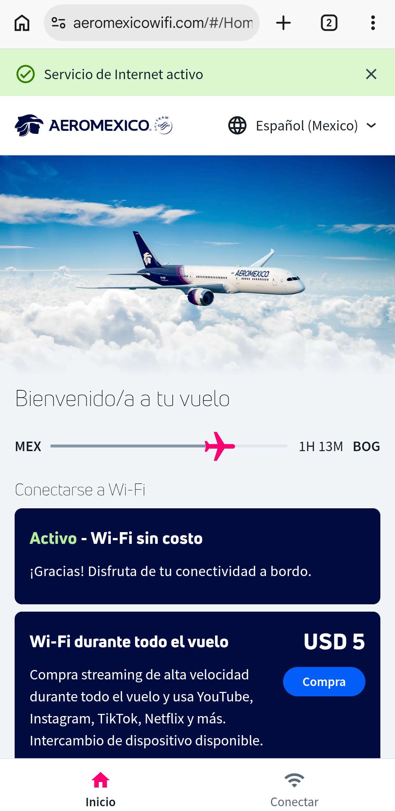
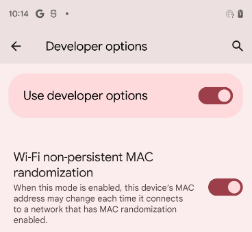

# Acceso gratis a la red Wi-Fi de Aeroméxico en dispositivos Android

## Introducción

Inicialmente, es necesario conectarse a la red inalámbrica del avión siguiendo estos pasos:

1. Seleccionar en la configuración de Wi-Fi del dispositivo y conéctate a la red llamada exactamente **Aeromexico-WiFi**.
2. Ingresar al formulario en el portal cautivo de la aerolínea www.aeromexicowifi.com. En esta pantalla, selecciona la opción de **15 minutos gratis**.

> Una vez que transcurra este plazo gratuito (15 minutos) el dispositivo no tendrá conexión a internet. Cuando esto suceda requiere restablecer el acceso a la red como se indica en las siguientes secciones de este documento.

## Configuración de la Dirección MAC

Dentro de las opciones avanzadas de la red, Android puede mostrar una configuración denominada **Privacidad**, **Tipo de dirección MAC** o una opción equivalente.

Dependiendo del dispositivo, pueden aparecer opciones como:

* **MAC del dispositivo**
* **MAC aleatoria**
* **Dirección MAC aleatoria**

Seleccione la opción de dirección MAC aleatoria cuando esté disponible.

La nueva dirección se utiliza para las conexiones correspondientes a esa configuración de red, de acuerdo con el comportamiento implementado por la versión de Android y el fabricante.

> Es necesario habilitar el modo de desarrollador en el dispositivo Android para acceder a estas opciones de configuración.

## Reconexión a la Red

Después de modificar la configuración de privacidad de la conexión:

1. Desconecte el dispositivo de la red Wi-Fi.
2. Vuelva a conectarse a la red.
3. Compruebe que la conexión funciona correctamente.
4. Complete nuevamente el proceso de autenticación correspondiente seleccionando navegación gratuita durante 15 minutos.

Si la conexión presenta problemas, deberá eliminar la configuración guardada de la red y volver a conectarse.