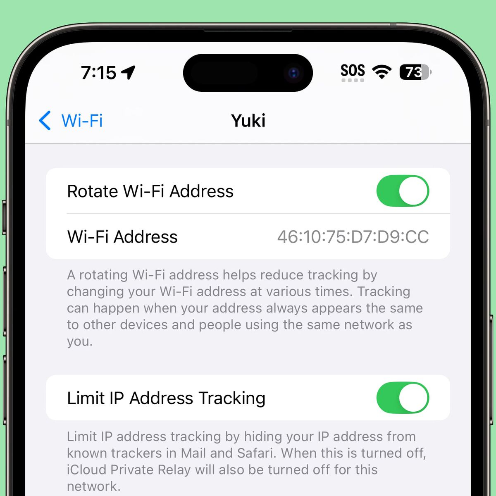

# Acceso gratis a la red Wi-Fi de Aeroméxico en dispositivos iOS

## Introducción

Inicialmente, es necesario conectarse a la red inalámbrica del avión siguiendo estos pasos:

1. Abrir la configuración de Wi-Fi del dispositivo y conectarse a la red llamada exactamente **Aeromexico-WiFi**.
2. Ingresar al formulario en el portal cautivo de la aerolínea www.aeromexicowifi.com. En esta pantalla, seleccionar la opción de **15 minutos gratis**.

> Una vez que transcurra este plazo gratuito (15 minutos), el dispositivo no tendrá conexión a internet. Cuando esto suceda, requiere restablecer el acceso a la red como se indica en las siguientes secciones de este documento.

## Configuración de la Dirección MAC

Dentro de la configuración de la red, iOS puede proporcionar una opción denominada **Dirección Wi-Fi privada** o una opción equivalente.

Dependiendo de la versión de iOS, pueden estar disponibles opciones relacionadas con direcciones MAC privadas o aleatorizadas. Habilite la opción **Dirección Wi-Fi privada** cuando esté disponible.

La dirección privada se utiliza para las conexiones correspondientes a esa configuración de red, de acuerdo con el comportamiento implementado por la versión de iOS y el dispositivo.

## Reconexión a la Red

Después de modificar la configuración de privacidad de la conexión:

1. Desconecte el dispositivo de la red Wi-Fi.
2. Vuelva a conectarse a la red.
3. Compruebe que la conexión funciona correctamente.
4. Complete nuevamente el proceso de autenticación correspondiente seleccionando navegación gratuita durante 15 minutos.

Si la conexión presenta problemas, elimine la configuración guardada de la red y vuelva a conectarse.